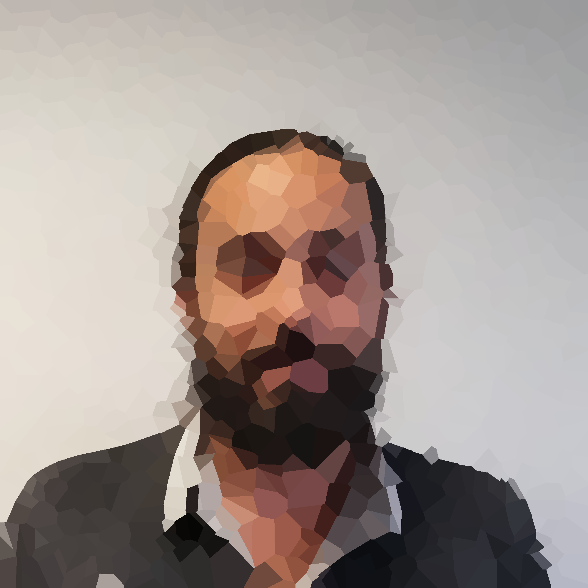
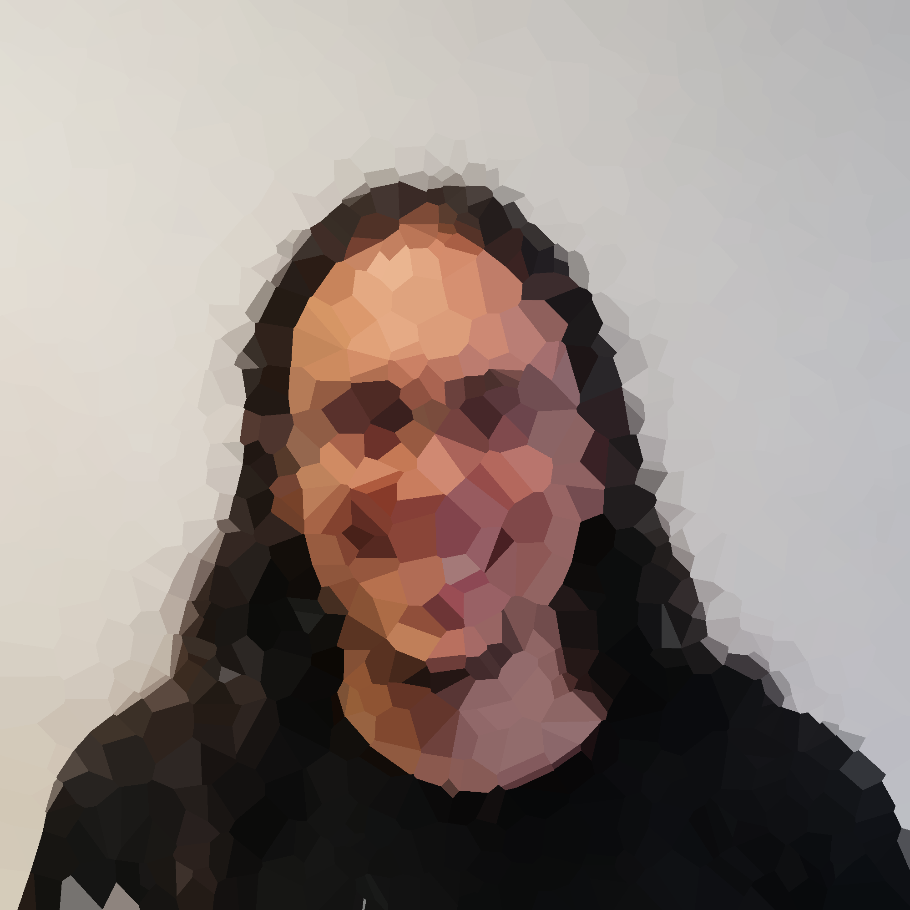

# Voronoi

I was surfing the internet during summer 2019 when I found this codegolf thread: [Draw an Image as a Voronoi Map](https://codegolf.stackexchange.com/questions/50299/draw-an-image-as-a-voronoi-map). I was curious to do some image "voronoization" myself, so I tried several of the provided solutions, especially the simple C++ one by Boojum. Then, I started to wonder if I could:
- obtain a better minimization between the original image and the target reconstructed voronoi map,
- speed up the process a bit (Boojum answer was short but overlong),
- and eventually use the output voronoi map to make transitions (interpolation) between two voronoi maps. 

So did I. The final process I came with is a three step algorithm:
1. transform input images to 5D Voronoi maps
2. find pairwise matching between two voronois maps
3. reconstruct a smooth transition using interpolation

And Tadaaaa:


[Here](data/output-lab-small.mp4) is a longer HD video. 

## Image Voronoization
The first step is based on the geometry paper [**Approximating Functions on a Mesh with Restricted Voronoï Diagrams**](http://alice.loria.fr/index.php/publications.html?redirect=0&Paper=VoronoiApprox@2013) by Vincent Nivoliers and Bruno Lévy. Starting with an initial set of random sites that define a Voronoi diagram, the algorithm aligns the boundaries of the Voronoi cells with the discontinuities of the input image. The associated gradient descent is a semi-discrete process that minimizes the squared difference between the original image and its Voronoi map approximation.

**Thanks to Vincent Nivoliers for his help on this part.**

### Implementation details
The implementation is in 'src/voronoization.h".
* Gradients evaluation strictly follows the fomulaes given in the paper.
* Use Nesterov acceleration to improve the convergence of the gradient descent (cf. [An overview of gradient descent optimization algorithms](https://arxiv.org/pdf/1609.04747.pdf)).
* The learning rate is modified taken into account:
    * the current iteration (decreasing movement over iterations),
    * the cell area (increased movement when the cell area is small).
* Several external sources are used in the implementation (extern/):
    * Fortune algorithm to compute the geometric Voronoi diagram (from Samir Sinha @samkusin [source](https://github.com/samkusin/gamelabs/tree/master/voronoi)),
    * Dunavant quadrature to integrate triangles color and Voronoi cells color (from John Burkardt [source](https://people.sc.fsu.edu/~jburkardt/cpp_src/triangle_dunavant_rule/triangle_dunavant_rule.html)),
    * Legendre quadrature to integrate color gradients over cell edges (from rosettacode.org [source](https://rosettacode.org/wiki/Numerical_integration/Gauss-Legendre_Quadrature)).

## Pairwise matching between Voronoi maps
Voronoi maps are 5D pointsets (XYRGB). Several solutions exists to compute closest point matching between two pointsets. However  their complexity is not far from O(n^4). More recently, Nicolas Boneel and David Coeurjoly propose to use optimal transport to perform poinset matching efficiently [**Sliced Partial Optimal Transport**](https://perso.liris.cnrs.fr/nbonneel/spot/).
This solution reduces the 5D transport problem to several 1D transport problems, is fast and easy to implement. 

Given two input voronoi maps the algorithm transports the first pointset towards the second. After the user-specified number of iterations, a closest point matching between the transported points and the second pointset is done using a 5D KD-tree, giving us the pairwise matching. 

### Implementation details
The implementation is in 'src/transport.h".
* Use Nesterov acceleration to improve the convergence of the gradient descent (cf. [An overview of gradient descent optimization algorithms](https://arxiv.org/pdf/1609.04747.pdf)).
* The learning rate is constant and I did not try any adaptive solution.
* The transport is done in normalized 5D space, each component is remapped to [0,1]. 
* Tried to support different colorspaces: RGB, HSV, LAB, YUV. But any other color spaces could be used. 

**Thanks to Lois Paulin for his help on this part.**

## Reconstruction
Given the pairwise matching we can interpolate (linearly or not) any number of transition maps between two voronoi maps. This process is used as many times as input images. Then each interpolated map is reconstructed as an image and saved.

### Implementation details
* The interpolation is done in normalized 5D space, each component is remapped to [0,1]. 
* Colorspace supported: RGB, HSV, LAB, YUV, but any other color spaces could be used. 
* The reconstruction distance can be any P-Distance, the default one is the Euclidean distance (2-distance).
* Use a 2D KD-tree to assign each cell color to its nearest pixels.

## Build instructions 

### Dependencies
The code uses the following dependencies:
* SDL2 [link](https://www.libsdl.org/download-2.0.php)
* SDL2_Image [link](https://www.libsdl.org/projects/SDL_image/)

### Build
* Build system: Premake [link](https://premake.github.io/download.html)

#### Linux
```
premake4 gmake
make
```

#### Windows
```
./premake4 vs2017 
make
```

### Specific Windows
You need to specify the path to the include and lib directory of the dependencies in the *premake4.lua* build file.

An example file tree for windows build:
```
voronoi/
    premake4/5          // binary
    premake4.lua
    data/
    src/
    bin/
        SDL2.dll
        SDL2_image.dll
    extern/
        visual/
            bin/
            include/
                SDL2/
                    SDL.h
                    SDL_image.h
            lib/
                SDL2.lib
                SDL2_image.lib
                SDL2_main.lib
```
and the associated premake4 lines:
```
-- extern libs
includedirs { "extern/visual/include" }
libdirs { "extern/visual/lib" }
links { "SDL2", "SDL2main", "SDL2_image" }
```

## Acknowledgments
Special thanks to Vincent Nivoliers for helpful discussions, coworkers from the LIRIS room 12.008 (and assimilated (:)) for discussions, feedback and permission to put their faces here.

|Axel Paris|Gabriel Meynet|Charles Barnouin|Oscar Argudo|Lois Paulin|
|:---:|:---:|:---:|:---:|:---:|
|||||

## Todo 
* Make a command line parser.
* Add .svg support.
* Try interpolation directly in the transport space.
* Bicubic resampling image instead of bilinear.
